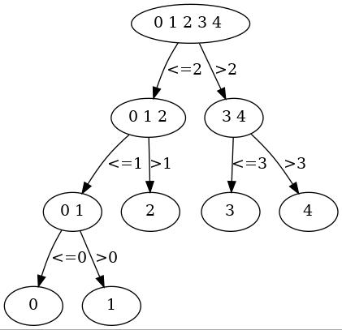
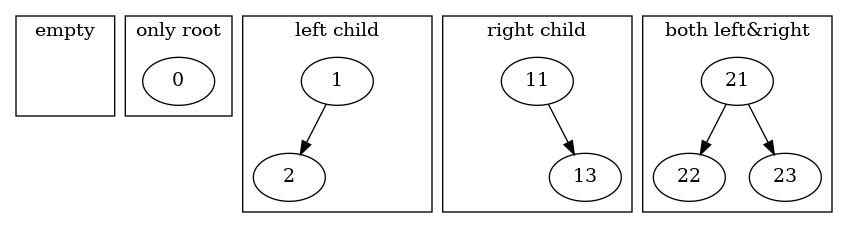

# 3-二叉树

{: .warning }
> 虽然直接使用裸指针写树写起来很方便，但在正式项目中，为了避免内存泄漏，至少应该用std::unique_ptr管理内存  
> std::unique_ptr的性能和裸指针一样，但需要注意其只移语义；std::shared_ptr写起来更方便，但由于引用计数是原子操作，有性能损失

在上一节，我们学了线性结构，我们来看一下线性结构的操作时间复杂度

||顺序表|链表|
|--|--|--|
|查询|O(1)|O(N)|
|添加|O(N)|O(N)|
|删除|O(N)|O(N)|
|更改|O(1)|O(N)|

其中链表的添加删除操作需要O(N)+O(1)时间，添加删除结点需要O(1)时间，但是寻找结点需要O(N)时间  
**这一节我们会介绍一种增删查改的平均时间复杂度都为O(logN)的数据结构**，即二叉搜索树（BST）

## 二分查找

假设我们有5颗小球，标号分别为0,1,2,3,4，已知它们的重量递增，现在有一颗小球X和一台天平，已知X和某一颗小球等重，怎样用最少的步数，保证能找出这颗等重的小球？

我们可以按照下面这张图的思路，先让X和2号球比较大小，如果X比2号重，那么说明X只能和3或者4号球等重，反之只能和0、1、2号等重（为了方便，这里把等于划到了小于部分，你可以认为这个天平卡住了，只能向右倾斜或者恢复水平。如果是正常的天平，可以分出小于、等于、大于三种情况）。接下来也按照类似的步骤。那么最多需要3步，就可以找到小球。

当然，由于这里小球的个数很少，我们也可以采用逐个比较的方法，也就只需要4步就能找到。



类似的想法在实际生活中也有很多应用，但不一定是恰好二分了。比如说，你在翻找《新华字典》的时候，你知道“数学”的读音，想找它的释义，这回你懒得翻目录了，随便翻了一页；翻到了“苟”这一页，你知道shu在gou的后面，于是你往后随便又翻了一页；翻到了“生”，shu在sheng的后面，于是你又往后翻了若干页；这次你翻到了“以”这一页，你知道shu在yi前面，你翻多了，于是往前回翻若干页；以此类推。这也是种采样——比较——更新的流程，不过当然，我们的大脑比单纯的二分查找要聪明很多

## 二叉树

上图是一种决策树的表示法，但我们可以用一种更为简单的方式表示，这种方法就是二叉树(Binary Tree)

二叉树的定义为，一棵空树是二叉树，再加上如果一棵树的左右子树都是二叉树，那么这棵树也是二叉树。简单来说，长得像下面这样的都是二叉树



或者说，每个结点最多有2个子结点的树形结构叫做二叉树。类似的，每个结点最多有k个子结点的树形结构叫做k叉树

## 二叉树的物理结构

### 顺序存储

我们可以用一个数组来存储一棵二叉树。我们约定，数组a[N]下标从0开始时，二叉树a[i]的左子树为a[2\*i+1]，右子树为a[2\*i+2]

注意，顺序存储二叉树时，常需要在叶结点的左右子树指向的空结点设置**哨兵**。例如，在一棵含有n个结点的完全二叉树（该概念会在[下文](#一些二叉树的概念)介绍）中访问a[i]，你可以通过比较`i < n`来判断是否为非空结点，或者，也可以通过在二叉树后紧跟的n+1个结点设置哨兵，当访问到哨兵时说明该结点是空结点

### 链式存储

链式存储的二叉树通常长下面这个样子

```cpp
struct Node{
    int data;
    struct Node *left,*right;
};
```

其中int作为存储的数据的类型，left和right为指向左右子树的指针。  
如果你的结点类名称很长或者觉得每次打一次`struct`很麻烦，可以使用`typedef`创建一个别名

```c
struct BinaryTreeNode; //前置声明
typedef struct BinaryTreeNode* Ptr;

struct Node{
    int data;
    Ptr left,right;
};
```

在C++中，在类的声明以外，无论是否用struct，都是允许的。此外，C++更推荐用`using`创建别名

```cpp
struct BinaryTreeNode; //前置声明
//typedef和using都是允许的
typedef BinaryTreeNode* Ptr_t;
using Ptr = BinaryTreeNode*;

using T = int;
struct Node{
    T data;

    //下面3种写法是等价的
    Ptr left,right;
    // struct Node *left,*right;
    // Node *left,*right;
};
```

## 一些二叉树的概念

这里只提一些不得不提的常见概念（如果描述一个结点，则称其为X）：

1. 根结点(root)：二叉树唯一的起始点。或者形象地说，没有指向它的箭头
2. 父结点(parent)：子结点的逆，如果B是A的子结点，那么A是B的父结点。或者形象地说，A有一个箭头指向B
3. 叶结点(leaf)：左右子结点都是空结点的结点。或者形象地说，没有从X出发的箭头
4. 结点的深度/高度：从根结点出发需要经过多少结点才能到X（是否包括根结点，不同教材规则不同）
5. 完全二叉树(complete binary tree)：对一棵树中的结点按从上至下、从左到右的顺序进行编号，从0到n-1，顺序存储时可以不更改地按照顺序填进数组，即a[i]对应编号为i的结点，那么这是一棵完全二叉树

## 二叉树的遍历

当我们定义了二叉树这个结构后，一个自然而然的问题是我们如何访问其中的结点。我们称访问二叉树中所有的结点为遍历(traversal)

先序遍历，中序遍历，后序遍历都可以用下面的递归模板实现

```cpp
#define PREORDER

void someorderTraverse(Node *BT,FUNCTION visit) {
    if (BT) {
#ifdef PREORDER
        visit(BT);
#endif
        someorderTraverse(BT->left);
#ifdef MIDORDER
        visit(BT);
#endif
        someorderTraverse(BT->right);
#ifdef POSTORDER
        visit(BT);
#endif
    }
}
```

{: .note}
> 这里借用了函数式编程的思想，将visit函数作为参数传入。这里可以简单地无视它，并认为定义过了一个全局函数`RETURN_TYPE visit(Node *node)`。对于有C语言基础的读者，可以认为这里的visit是一个函数指针，并且`using FUNCTION = RETURN_TYPE(Node*);`。或者认为这是`std::function<RETURN_TYPE(Node*)>`

不要被上面的预处理宏吓到。以先序遍历为例，在经过C语言预处理器（如gcc -E）之后，你就可以得到

```cpp
#define PREORDER

void someorderTraverse(Node *BT,FUNCTION visit) {
    if (BT) {
        visit(BT);
        someorderTraverse(BT->left);
        someorderTraverse(BT->right);
    }
}
```

层序遍历

## 二叉搜索树(BST) *ADT*
