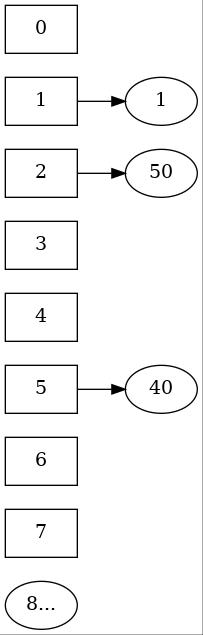
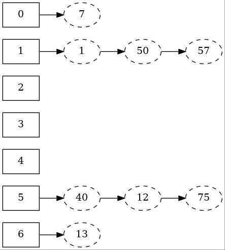
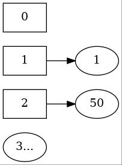
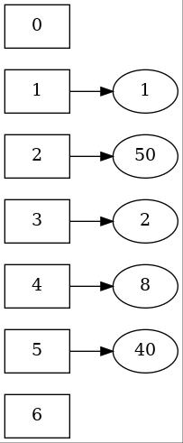

# 4-散列
{: .no_toc}
1. TOC  
{:toc}

上一节我们提到，为了达到访问效率为O(logn)，我们引入了二叉树。二叉树的最差访问效率为O(n)，平均访问效率为O(logn)。这一节我们更近一步，介绍一种经典的以空间换时间的数据结构——散列，或者哈希表(hash table)，它的平均访问效率为O(1)

## 散列

散列通常用在字符串中，比如"Hello world"通过SHA-1得到的哈希值为`7B502C3A1F48C8609AE212CDFB639DEE39673F5E`

为了简单起见，我们暂时把散列用在比较小的数字上，体会一下散列的核心思想

## 散列表的相关概念

例如，我们选取散列函数为`lambda x: x%7`（即f(x)=x mod 7），选取表长11，依次插入1，13，50，40，可以得到下图所示结构



1. 关键字(key)：待插入的元素的原始数据，如本例中的1，40，50
2. 散列函数/哈希函数(hash function)：将关键字映射为地址的函数，形如Addr=H(key)，其中H为散列函数。如本例中为f(x)=x mod 7。散列函数的好坏对于散列的性能有着至关重要的影响。
3. 哈希值(hash value)：散列函数映射出的地址也叫哈希值。散列实际上操作的是键值对<key,value>
4. 散列表长(table size)：散列表最多能容纳的关键字个数，很多情况下散列表长就等于散列函数可能的结果数（如本例中为7），但也可以不同
5. 碰撞(collision)：当遇到两个哈希值相同的关键字时，我们称发生了一次碰撞。如本例中，1和50的哈希值都是1，他们就发生了碰撞。因为碰撞的存在，散列表的结果和插入顺序是息息相关的。下文将会介绍两种碰撞处理的方法，本例中用的是开放寻址法
6. 负载因子(load factor)：(假设表长和散列函数结果数相同)负载因子=表中已有的元素个数/表长。当表中已有元素个数很多时，发生碰撞的概率会大大增加。因此在实际应用中我们可以通过负载因子来提前调整散列表(如再散列Rehashing)
7. 平均查找长度(Average Search Length, ASL)：衡量散列表性能的一个指标。每对一个散列表中的存储单元进行查看，查找长度就增加1。平均查找长度的具体定义视具体情况而定。一个常见的定义是，对于表长为n的散列表，查找失败时的 $ASL={1 \over n} \sum^n_{i=0} SL_{fail}$

## 碰撞处理

我们介绍两种简单的碰撞处理方法，拉链法和开放寻址法

### Seperate Chaining

分离链接法，或者拉链法指，当有哈希值一样的关键字时，将它们存储到一个链表中，如图



```cpp
using Index = int;
using Key = int;
using Function = std::function<Index(Key)>;

struct HashTable {
    int table_size;
    std::vector<std::list<Key>> cells;
    Function hash_fn;

    void initialize(); //初始化
    void insert(Key key) {
        //获取哈希值
        Index idx = hash_fn(key);
        //简洁起见，此处插入链表直接使用STL的实现
        cells[idx].push_back(key);
    }
}
```

### Open Addressing

分离链接法的缺点是需要使用指针及链表的数据结构。开放寻址法是另一种处理碰撞的方式。开放寻址法在发生碰撞时，尝试寻找另一个地址存放关键字。因此开放寻址法一般需要更大的表长

或者说，开放寻址法尝试在 $h_i(X) = (Hash(X) + F(i)) \mathrm{mod}\ \mathit TableSize$ 中寻找一个空位

我们用下述结构的散列表进行讨论。和前一节一样，你可以忽略Function并将其视为一个全局函数

```cpp
using Index = int;
using Key = int;
using Function = std::function<Index(Key)>;

struct HashTable {
    int table_size;
    std::vector<Key> cells;
    Function hash_fn;

    void initialize(); //初始化
    bool isIndexEmpty(Key key); //返回当前index是否存在有效值
}
```

#### 线性探测

线性探测(linear probing)在遇到冲突时，依次向后寻找地址，直到发现空位或者表满。即 $F(i)=i$

```cpp
std::optional<Index> insert(Key key, HashTable *HT) {
    //获取哈希值
    Index idx = hash_fn(key);
    //线性探测
    int size = HT->table_size;
    for (int i=0;i < size;++i) {
        Index cur_idx = (idx + i) % size;
        if (HT->isIndexEmpty(cur_idx)) {
            HT->cells.at(cur_idx) = key;
            return cur_idx;
        }
    }
    return {};
}
```

{: .note}
> std::optional是C++17引入的新特性。你也可以不使用optional，而是靠返回-1之类的特殊值进行判断。optional就是为了这种可能失败的返回值而设计的，同时强制通过obj.has_value()和obj.value()检查以避免遗忘特殊值检查

比如前面的例子，哈希值为1的位置已经有元素1存在了，元素50不能在放在哈希值为1的位置了，因此向后探测，然后放在哈希值为2的位置



线性探测的步长可变，但如果要遍历全表，必须满足gcd(step,table_size)=1，其中gcd表示最大公约数。可见step为1时是满足该等式的一个平凡条件


#### 元素的删除

由于哈希碰撞的存在，我们不能直接删除一个元素。比如之前的例子，元素50由于元素1的存在，被迫放在了哈希值2的位置，如果我们直接删除元素1，那么再次寻找元素50的时候就会发现在哈希值1的位置没有元素了，程序会误认为散列表中没有元素50。为了避免这个问题，我们需要采用一种延迟删除(lazy deletion)方法，即在删除元素时并不直接从散列表中移除，而是标记一个脏位dirty，在下次插入时覆盖

#### 哈希聚集(clustering)

ps: 本段中，哈希值的平均查找长度(ASL)指，对于一个含有k个关键字的**哈希值**，其成功访问和查找失败的长度平均值，即 ${1 \over 2}(SL_{fail}+{1 \over k} \sum^k_{i=0} SL_{success})$

当我们采用线性探测时，比如[前例](#散列表的相关概念)中插入1和50后，哈希值为2的位置也被占据了，这时如果要插入哈希值为2的元素，就要后移插入哈希值为3的位置

> 观察此时哈希值5的位置，假设此时要插入新元素5，它只会影响自身的ASL

如果再插入一个哈希值为1的元素(例如8)，就要把哈希值为4的位置占了。注意这个时候如果要插入新元素5，它**不但会影响自身的ASL，还会同时增加哈希值为1,2,3,4的ASL**！并且哈希值为1 2 3 4的元素的插入**不但会增加其余各个哈希值的ASL，还会增加影响的哈希值的范围**

这种像滚雪球一般严重影响哈希表ASL的现象称为初次聚集(primary clustering)。可以通过平方探测避免初次聚集



#### 平方探测

线性探测在发生碰撞后，对于该哈希值，依次访问index加上{0,1,2,3,4,...}。而平方探测(quadratic probing)则是选择 $F(i)=i^2$，依次访问{ $0,1,-1,4,-4,...$ }， 即{ $0,\pm 1,\pm 2,...$ }


```cpp
std::optional<Index> insert(Key key, HashTable *HT) {
    //获取哈希值
    Index idx = hash_fn(key);
    //平方探测
    int size = HT->table_size;
    for (int i=0;i < size;++i) {
        Index cur_idx = idx + pow(-1,i) * ((i+1)/2);
        if (HT->isIndexEmpty(cur_idx)) {
            HT->cells.at(cur_idx) = key;
            return cur_idx;
        }
    }
    return {};
}
```

可以证明，当表长为素数并且表至少半空时，平方探测总能成功插入。此时需要密切关注负载因子。此外，如果表长为素数并且满足形式为n=4k+3，那么平方探测可以访问整个散列表

不过平方探测也存在问题，由于线性探测和平方探测的寻址都与关键字值无关，对于相同哈希值的不同关键字，都需要探测相同的序列。例如对于哈希表长为11哈希值为6的关键字来说，都要探测序列{6,7,5,10,2...}。这种情况被称为二次聚集(secondary clustering)。《DSA in C》在p163指出，二次聚集仅是一个小瑕疵，模拟实验结果显示平方探测对于每次查找的影响仅不到半次探测。下文要介绍的双散列法可以避免初次聚集和二次聚集，但额外的乘除法同样会引入性能开销

#### 双散列法

双散列法(double hashing)的一个选择是 $F(i)=i·hash_2(X)$，即使用另一个哈希函数进行哈希，对于这个新的哈希值H2，每次隔着H2个地址寻找空位

同时，哈希函数 $hash_2$ 的选择也很重要，对于上述 $F(i)$，新的哈希值不应为0，否则就会一直在地址0打转。选择一个比表长略小的素数R，函数 $hash_2(X)=R-(X \mathrm{mod}\ R)$ 就是一个不错的选择。此外，为了遍历全表，需要 $hash_2$ 的结果尽量与表长互素，等等。

一种名为[Enhanced double hashing](https://en.wikipedia.org/wiki/Double_hashing)的变体，选取 $F(i)=i·hash_2(X)+{1\over 6}(i^3-i)$ ，它解决了双散列存在的理论问题，同时放宽了对哈希函数 $hash_2$ 的选择，并且可以通过前向差分高效计算

此外由于cache性能的影响，并不是单纯的聚集越少越快。线性探测具有最佳的cache性能，但对聚类最敏感，而双散列的cache性能较差，但几乎没有聚类；平方探测介于这二者之间。《DSA in C》p165提到平方探测在实际应用中更有可能表现更好

## 再散列Rehashing

当散列表中已有元素个数很多时，发生碰撞的概率会大大增加。为了减轻后续可能发生的碰撞，我们可以通过增大表长，将已有元素重新散列一次的方法来减小载荷因子。一般会将表长倍增到2倍左右

对于使用平方探测的散列表来说，再散列的时机可以选择为负载因子刚过0.5时，也可以选择直到发生了一次插入失败为止，或者结合两者，在负载因子达到一个特定值时再进行再散列

再散列需要花费O(n)的时间，但是由于之前已经发生了n/2次插入，对于程序整体来说，仅是增加了一个常数。但是对于实时性要求很高的场景（如医疗航天等），再散列的过程会有可以察觉的停顿，期间可能会发生不可挽回的情况。