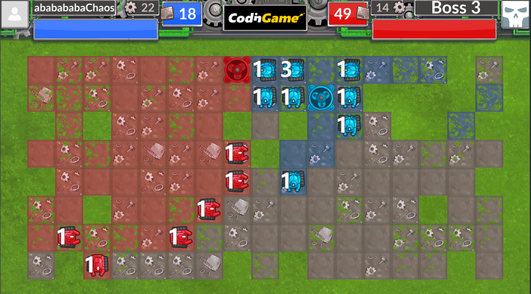

- TOC
{.toc}

本章我们将从走迷宫，以及CodinGame的一次event——[KeepOffTheGrass](https://github.com/CodinGame/FallChallenge2022-KeepOffTheGrass)导入，来讲一些图算法

整体上来说，我们需要操控机器人去占领方块，最终占领方块多的一方获胜。你可以消耗资源造新机器人，也可以建造回收机获取资源，但是回收机所在的格子无法通过，更具体的规则见[规则书](CodinGame%202022Fall%20Rule.pdf)

又例如，如果我们遇到了这么一种情况

这时棋盘被分成了许多种情况，由于机器人无法越过绿色草地，对于不同区域（我们称为连通分量）的策略是不同的。比如，如果某个区域已经都被自己占领了，就不应该在上面继续造机器人；如果某个区域只有自己占领的方块和未被占领的方块，就应该让机器人去占领全部方块，等等。这时就需要用到图相关的算法