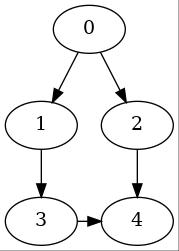
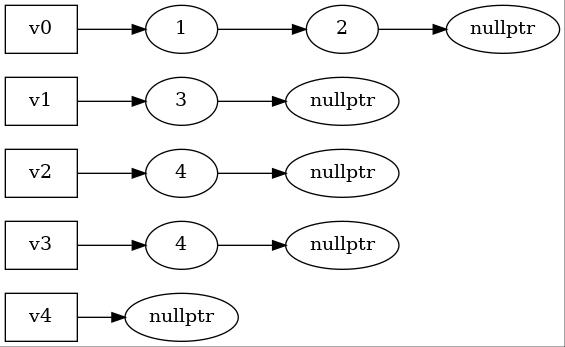

# 图Graph

{: .note}
> 不同教材对于图的术语的定义很不同。为了减轻记忆负担，这里采用《DSA in C》的版本，称顶点不重复的路径为简单路径。在一些教材（和wiki）中，你可能会见到它们各自对应的是通路(walk)和路径(path)
 
一个**图(Graph)**由**顶点集(Vertices)** 和**边集(Edges)** 组成，即 $G=(V,E)$, 其中 $E=\{(v,w) \mid v,w \in V\}$. 

图的概念*非常多*，下面列了一些即将会遇到的概念。初学时如果一下子记不住这么多，可以先跳过，等遇到了再回来查看

1. 如果顶点对 $v,w$ 是有序的，那么称这个图是**有向的**，否则是**无向的**。有向图的边又被称为**弧(arc)**
2. 两个顶点 $v,w$ 是**邻接的(adjacent)**，当且仅当 $(v,w)\in E$
3. 有些边除了两个端点外，还会有另一个属性**权重(weight)**
4. 图中的一条**路径(path)** 是指一个顶点序列 $w_1,w_2,w_3,...,w_n \ s.t. (w_i,w_{i+1})\in E\ for\ 1\le i\le n$，即只能经过图中的边，不能跨边走。如果一条路径中（除了首尾外）的顶点各不相同，则称这是一条**简单路径(simple path)**
5. 如果图中包含一条长度为0，起点和终点都是 $v$ 的路径，则称这条路径为**自环(loop)**
6. 如果一条简单路径（顶点各不相同）的长度不为0，起点和终点相同，则称这条路径为为**环(cycle)**。如果允许首尾外的顶点重复但不允许边重复，这条路径又被称为**回路(circuit)**
7. **有向无环图(Directed Acylic Graph, DAG)**：没有环的有向图
8. 对于无向图，如果对于每一个顶点，都存在一条通往其他顶点的路径，则称它是**连通的(connected)**
9. 对于有向图，如果它具有上面一条的性质，则称它是**强连通的**。如果一个有向图不是强连通的，但是去掉边的箭头后剩下的图（基图）是连通的，则称它是**弱连通的**
10. 如果一个图 $G$ 的子图 $G'$ 也是连通的，则称 $G'$ 为 $G$ 的**连通子图**。如果 $G'$ 再添加任意一个 $G'$ 中没有的顶点，都不是连通的，那么称 $G'$ 是 $G$ 的**极大连通子图**，或者叫**连通分量**。或者说，如果一张图像是多个分离的岛屿组成的，每一个岛屿都是一个连通分量  
</img>
> "我国南海西沙群岛 图片来源https://www.zhihu.com/question/398721880"


## 图的表示

### 邻接矩阵表示法

假设一个图有N个顶点，那么构建一个N*N的矩阵a[N][N]，并且默认值为0或者-1等等。每行和每列按照下标顺序表示顶点。此外我们约定，当表示有向图时，第i行表示从i出发的弧，第j列表示到j结束的弧

对于无向图来说，如果 $(u,v)\in E$，就更新`a[u][v]=a[v][u]=1;`，如果这条边有权重w，那么就更新`a[u][v]=a[v][u]=w;`。*无向图的邻接矩阵是对称的*，因此也可以通过压缩矩阵的方式减少空间，内容比较trivial，这里不展开介绍了

对于有向图来说，如果 $\langle u,v\rangle \in E$，就更新`a[u][v]=1;`，如果这条边有权重weight，那么就更新`a[u][v]=w;`，其中 $\langle u,v\rangle$ 表示从 $u$ 出发到 $v$ 的一条弧

如果不考虑顶点下标顺序的互换，那么一张图的邻接矩阵表示法是唯一的

<center></img></center>

假设我们有上图所示的一张图，用邻接矩阵可表示为

$$
\begin{bmatrix}
0 &1 &1 &0 &0 \\
0 &0 &0 &1 &0 \\
0 &0 &0 &0 &1 \\
0 &0 &0 &0 &1 \\
0 &0 &0 &0 &0 \\
\end{bmatrix}
$$

比如从0出发，有到1和2的两条弧，那么在第0行，第1和第2列就为1，其余为0。从1出发，有到3的一条弧，那么在第1行，第3列就为1，其余为0。没有从4出发的弧，于是第4行就全为0。以此类推。

### 邻接表表示法

尽管邻接矩阵的表示非常简单，但它的空间复杂度为 $\Theta(|V|^2)$，当图的边数比较少，或者说图是**稀疏的(sparse)** 的时候，一个更好的方法是采用邻接表表示，对于每一个顶点，我们将所有与它邻接的边存入一个链表，这样空间复杂度仅为 $\Theta(|V|+|E|)$

上例用邻接表可表示为



## 图的遍历

和树一样，在定义了图的结构后，我们来考虑如何遍历它

### 深度优先遍历

如果以走迷宫来比喻深度优先遍历（Depth First Search, DFS）的话，那就是“不撞南墙不回头”。你可以想象DFS就是每到岔路往左走，直到死路再回头。

在代码实现中，就是每次对遇到的顶点，递归遍历其所有邻接顶点，直到没有可遍历目标为止。当然，如果仅是遍历的话，可能会在原地打转，因为考虑A-B边，A可以到B，B也可以到A，如此往复。因此我们需要同一个visited数组来保存是否遍历过该顶点

```cpp
using std::vector;

struct Graph;
Function visit;

void DFSWrapper(Graph &G) {
    int nV = G.num_V;
    //由于nV不确定，使用变长的vector
    vector<bool> visited(nV);

    for (int v=0;v < nV;++v)
        //传入源点、邻接矩阵等参数
        //由于int[][]不保留数组长度信息，需要额外传入nV，可以考虑用vector<vector<int>>存储
        DFS(v,nV,G->adjacent,visited);
}

void DFS(int V, int nV, int **G, vector<bool> &visited) {
    //从单源出发DFS
    visit(V);
    visited[V] = true; //缺少该句会无穷递归
    for (int i=0;i < nV;++i) {
        //如果还未访问过邻接顶点
        if (G[V][i]) {
            if (!visited[i])
                DFS(i,nV,G,visited); //递归访问
        }
    }
}
```

{: .warning}
> vector<bool>不是bool的vector，而是bit的vector，使用时应格外注意

### 广度优先遍历

与DFS不同，迷宫中广度优先遍历（Breadth First Search, BFS）的策略是，每次遍历下一步可以走的所有可能性（不走回头路）。一般来说，在初期BFS的选项越来越多，越走越宽，所以称为广度优先，相应的，需要的存储存储空间会增大

如果你看过一种神奇的黏菌走迷宫的[视频](https://www.bilibili.com/video/BV1bU4y1F7rF)的话，你可以注意到在资源充足的情况下，它采用的方式就是BFS


```cpp
using std::queue;
using Index = int;

struct Graph;
Function visit;

void BFS(Graph &G) {
    int nV = G.num_V;
    //由于nV不确定，使用变长的vector
    vector<bool> visited(nV);

    for (int v=0;v < nV;++v) {
        ////从单源出发BFS
        if (visited[v])
            continue;

        //前面的章节讲过queue了，这里直接用STL，省去具体实现
        queue<Index> Q;
        Q.push(v);
        while(!Q.empty()) {
            Index V = Q.top(); //获得队首
            visit(V);
            visited[V] = true;
            for (int i=0;i < nV;++i) {
                //如果还未访问过邻接顶点
                if (G->adjacent[V][i]) {
                    if (!visited[i])
                        Q.push(i); //入队
                }
            }
            Q.pop(); //更新队首指针
        }
    }

}
```

DFS和BFS并无绝对好坏之分，你可以构造一个最深路径很长，通关路径比较短的迷宫，这种情况下DFS表现较差；你也可以构造最深路径和通关路径差不多长，但是分支很多的迷宫，这种情况下两者性能差不多但是BFS比较耗内存

### DFS/BFS的连通性

一次DFS/BFS会访问完一个连通分量，从直觉上说，一次DFS/BFS访问了一个顶点能访问的所有顶点，这也很合理。因此可以通过DFS/BFS测试图的连通性。一次遍历之后如果有未访问的顶点（visited未全部为true），则说明该图不是连通的；可以通过所需要的DFS/BFS次数确定图的连通分量数，等等